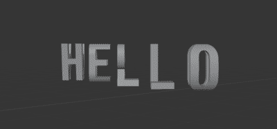

# aallpphhaabbeett

Python script to generate 3D letter intersections with blender.




The script generates all uppercase letter combinations and digits 0 to 9, saving every 
mesh as a separate STL file into an output directory. 

It generates ALL combinations. The same pair of letters, like `AB` and `BA` will generate
the same mesh but with a different orientation. This wastes time and storage space but 
the meshes are pretty small and it makes further scripting easier. Feel free to optimize it.  

Runing the script will make blender unresponsive for minutes, speed depends on
CPU performance due to excessive boolean operations (I think).

## Fonts

The font can be customized in the script but picking a good font can be tricky if you want all
letter combinatios to work. Monospaced fonts have a better chance of
success because they mostly fit into a square bounding box.

Look out for `Q` and `J`. In many fonts they tend to have their defining parts below the baseline. Intersected with another
letter Q often becomes O and J becomes I.

Fonts with floating dottes zeroes are not 3D printable.


## Ideas / TODOs

- [ ] different fonts for the 2 sides
- [ ] 3 sided letters?
- [ ] detect if a letter has parts below baseline (maybe a separate script that eats a ttf and spits out bonding boxes?)
- [ ] speed up by generating many (all?) letters at once

## misc

The gif with "boomerang" looping was generated from a screen capture with ffmpeg. Putting together ffmpeg command lines make 
my brain hurt so here it is to save brain power next time: 

```
ffmpeg -i hello_world.mov -filter_complex "[0]reverse[r];[0][r]concat=n=2:v=1:a=0,fps=fps=14,scale=400:-1:flags=bilinear,split[s0][s1];[s0]palettegen=max_colors=8[p];[s1][p]paletteuse" output2.gif
```
